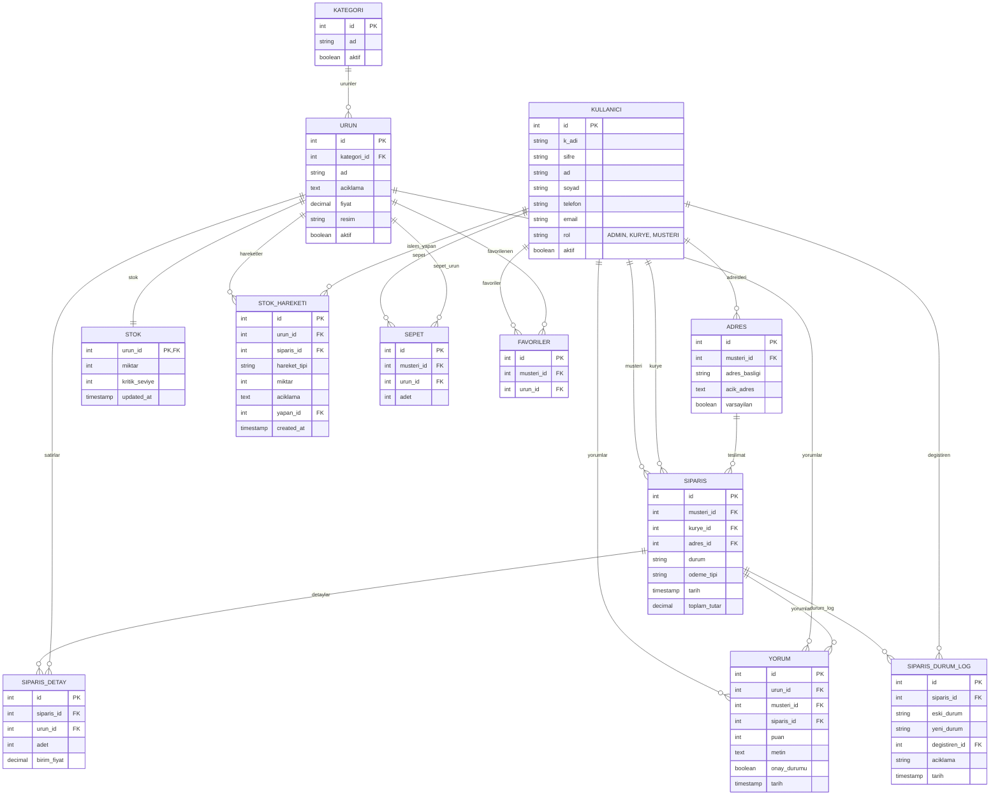

# Tuna Fırın - Veritabanı ER Diyagramı (Final)

Bu diyagram, projede aktif kullanılan **final şemayı** gösterir ve `firin_db.sql` ile uyumludur.

```mermaid
erDiagram
    KULLANICI {
        int id PK
        string k_adi
        string sifre
        string ad
        string soyad
        string telefon
        string email
        string rol "ADMIN, KURYE, MUSTERI"
        boolean aktif
    }

    ADRES {
        int id PK
        int musteri_id FK
        string adres_basligi
        text acik_adres
        boolean varsayilan
    }

    KATEGORI {
        int id PK
        string ad
        boolean aktif
    }

    URUN {
        int id PK
        int kategori_id FK
        string ad
        text aciklama
        decimal fiyat
        string resim
        boolean aktif
    }

    STOK {
        int urun_id PK, FK
        int miktar
        int kritik_seviye
        timestamp updated_at
    }

    STOK_HAREKETI {
        int id PK
        int urun_id FK
        int siparis_id FK
        string hareket_tipi
        int miktar
        text aciklama
        int yapan_id FK
        timestamp created_at
    }

    SEPET {
        int id PK
        int musteri_id FK
        int urun_id FK
        int adet
    }

    SIPARIS {
        int id PK
        int musteri_id FK
        int kurye_id FK
        int adres_id FK
        string durum
        string odeme_tipi
        timestamp tarih
        decimal toplam_tutar
    }

    SIPARIS_DETAY {
        int id PK
        int siparis_id FK
        int urun_id FK
        int adet
        decimal birim_fiyat
    }

    SIPARIS_DURUM_LOG {
        int id PK
        int siparis_id FK
        string eski_durum
        string yeni_durum
        int degistiren_id FK
        string aciklama
        timestamp tarih
    }

    YORUM {
        int id PK
        int urun_id FK
        int musteri_id FK
        int siparis_id FK
        int puan
        text metin
        boolean onay_durumu
        timestamp tarih
    }

    FAVORILER {
        int id PK
        int musteri_id FK
        int urun_id FK
    }

    %% İLİŞKİLER
    KULLANICI ||--o{ ADRES : "adresleri"
    KULLANICI ||--o{ SIPARIS : "musteri"
    KULLANICI ||--o{ SIPARIS : "kurye"
    ADRES ||--o{ SIPARIS : "teslimat"

    KATEGORI ||--o{ URUN : "urunler"
    URUN ||--|| STOK : "stok"
    URUN ||--o{ STOK_HAREKETI : "hareketler"
    KULLANICI ||--o{ STOK_HAREKETI : "islem_yapan"

    SIPARIS ||--o{ SIPARIS_DETAY : "detaylar"
    URUN ||--o{ SIPARIS_DETAY : "satirlar"
    SIPARIS ||--o{ SIPARIS_DURUM_LOG : "durum_log"
    KULLANICI ||--o{ SIPARIS_DURUM_LOG : "degistiren"

    KULLANICI ||--o{ SEPET : "sepet"
    URUN ||--o{ SEPET : "sepet_urun"

    KULLANICI ||--o{ FAVORILER : "favoriler"
    URUN ||--o{ FAVORILER : "favorilenen"

    KULLANICI ||--o{ YORUM : "yorumlar"
    URUN ||--o{ YORUM : "yorumlar"
    SIPARIS ||--o{ YORUM : "yorumlar"
```
